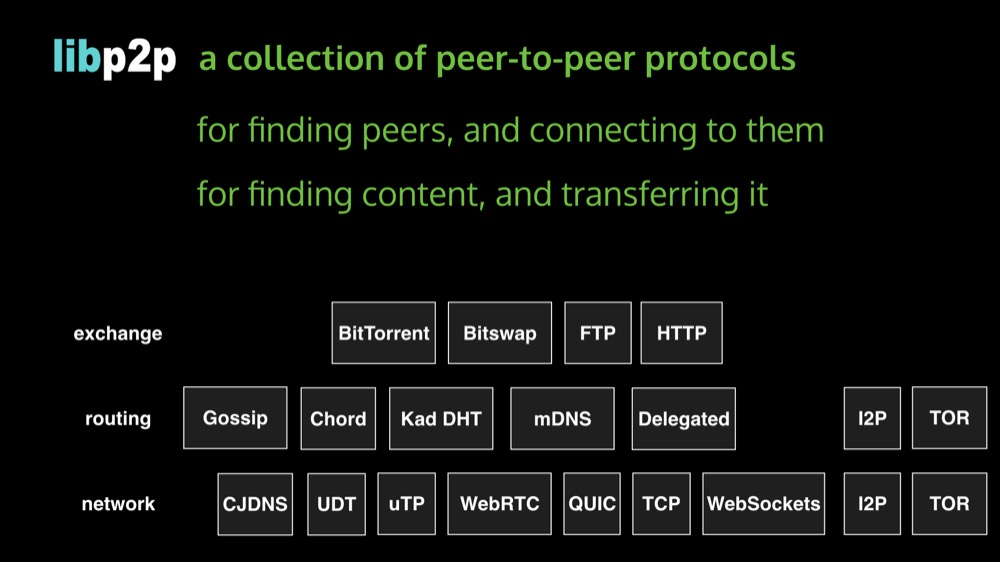
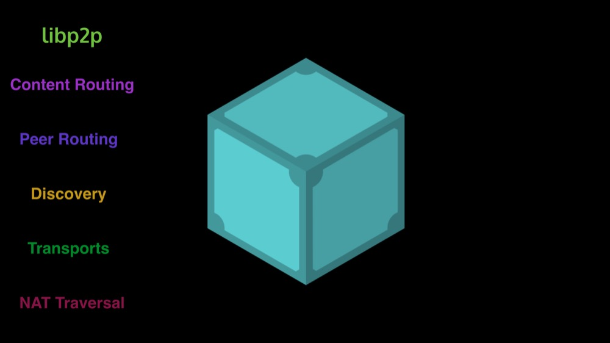
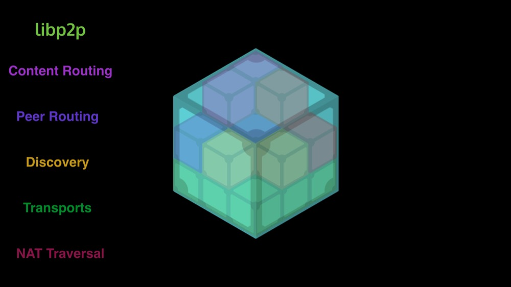

# libp2p

This document presents libp2p, a modularized and extensible network stack to overcome the networking challenges faced when doing peer-to-peer applications. libp2p is used by IPFS as its networking library.

# Description

libp2p is a networking stack and library modularized out of The IPFS Project, and bundled separately for other tools to use.

libp2p is the product of a long, and arduous quest of understanding -- a deep dive into the internet's network stack, and plentiful peer-to-peer protocols from the past. Building large scale peer-to-peer systems has been complex and difficult in the last 15 years, and libp2p is a way to fix that. It is a "network stack" -- a protocol suite -- that cleanly separates concerns, and enables sophisticated applications to only use the protocols they absolutely need, without giving up interoperability and upgradeability. libp2p grew out of IPFS, but it is built so that lots of people can use it, for lots of different projects.

We will be writing a set of docs, posts, tutorials, and talks to explain what p2p is, why it is tremendously useful, and how it can help your existing and new projects.

## Implementations

- [go-libp2p](//github.com/libp2p/go-libp2p) in Go
- [js-libp2p](//github.com/libp2p/js-libp2p) in Javascript, for Node and the Browser

## Stub Explanation

### libp2p is the networking layer of IPFS

### a collection of p2p protocols

### modules that satisfy interfaces (roles)

### The whole of IPFS ...

### ... is made up of libp2p modules

### libp2p has two impls so far: Go and JS

### libp2p cool demo: orbit.libp2p.io (p2p chat)

